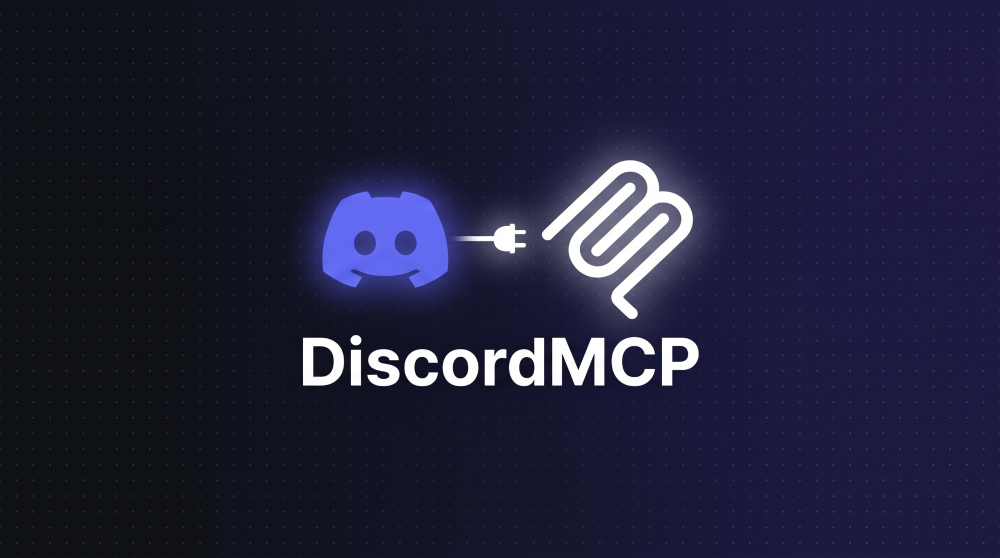

<p align="center">
  
</p>

<h1 align="center">DiscordMCP</h1>

<p align="center">
  <b>Discord MCP server</b> — let Claude and other AI clients control your Discord account
</p>

<p align="center">
  <a href="#installation"></a>
  <a href="#"></a>
  <a href="#"></a>
  <a href="LICENSE"></a>
</p>

---

An MCP server that gives Claude and other AI assistants access to your Discord: read channels, send messages, manage DMs, react, search, and more. Works via a **user token** (self-bot) powered by `discord.js-selfbot-v13`.

> ⚠️ **Heads-up.** Self-botting violates Discord's ToS. Your account can get banned. Use at your own risk — ideally on a secondary account. Never share your token, it grants full control over the account.

## Features

| Tool | What it does |
|---|---|
| `who_am_i` | Show the logged-in account |
| `list_servers` | List every guild the account is in |
| `get_server_info` | Details for a specific guild |
| `list_channels` | List text channels in a guild |
| `read_messages` | Read the last N messages in a channel |
| `send_message` | Send a message (can reply to another one) |
| `edit_message` | Edit a message you sent |
| `delete_message` | Delete a message |
| `list_dms` | List open DMs and group DMs |
| `open_dm` | Open a DM with a user by ID |
| `get_user_info` | Look up a user by ID |
| `search_messages` | Search a channel's recent messages for a substring |
| `add_reaction` | React to a message |
| `set_status` | Change presence (online/idle/dnd/invisible) |

## Installation

```bash
git clone https://github.com/Ernest1101/DiscordMCP.git
cd DiscordMCP
npm install
npm run setup
```

That's it. The setup wizard will:

1. Scan your local Discord desktop client for logged-in accounts (Windows).
2. Show you a menu of accounts (by real username, verified against Discord's API).
3. Save the chosen token to `DiscordMCP/.env` — never sent anywhere.
4. Build the server (`npm run build`).
5. Detect installed AI clients (Claude Desktop, Cursor, Claude Code, Continue) and offer to install the MCP config for you.

<details>
<summary>Manual setup (skip the wizard)</summary>

```bash
npm install
npm run build
```

Then create a `.env` with your token — see [Getting your user token](#getting-your-user-token) below.

</details>

## Getting your user token

*(If you ran `npm run setup` above and it detected your account, you can skip this.)*

1. Open Discord in a browser.
2. F12 → **Network** tab.
3. Reload the page and pick any request to `discord.com/api/...`.
4. Copy the `authorization` header value — that's your token.

Never publish this token and never share it with anyone.

## Configuration

> 🔒 **Do not put your token into the MCP client config.** Client configs are often opened during demos/screenshares. Keep the token in a separate file that stays on your machine.

### Recommended: `.env` file in the project folder

Copy `.env.example` to `.env` inside the `DiscordMCP/` folder and paste your token:

```
DISCORD_TOKEN=your_token_here
```

The server automatically reads this file at startup. `.env` is git-ignored, so it will never be committed.

### Alternative: separate token file (`DISCORD_TOKEN_FILE`)

If you want to keep the token even further away from the repo — e.g. in `%APPDATA%\discord-mcp\token.txt` or `~/.config/discord-mcp/token`:

1. Create a plain text file containing **just the token** (no quotes, no `DISCORD_TOKEN=`).
2. Point the server at it via the `DISCORD_TOKEN_FILE` env var in your MCP client config.

That way the config only stores a **path**, not the token itself.

## Claude Desktop setup

Open the Claude Desktop config:

- **Windows:** `%APPDATA%\Claude\claude_desktop_config.json`
- **macOS:** `~/Library/Application Support/Claude/claude_desktop_config.json`

Add this under `mcpServers` — **no token in the config**:

```json
{
  "mcpServers": {
    "discord": {
      "command": "node",
      "args": ["C:\\path\\to\\DiscordMCP\\dist\\index.js"]
    }
  }
}
```

The server picks up the token from `DiscordMCP/.env` automatically.

Prefer a separate token file? Point at it via env:

```json
{
  "mcpServers": {
    "discord": {
      "command": "node",
      "args": ["C:\\path\\to\\DiscordMCP\\dist\\index.js"],
      "env": {
        "DISCORD_TOKEN_FILE": "C:\\Users\\you\\AppData\\Roaming\\discord-mcp\\token.txt"
      }
    }
  }
}
```

Restart Claude Desktop — the `discord` tool set will show up in the tools list.

## Claude Code setup

```bash
claude mcp add discord -- node C:\path\to\DiscordMCP\dist\index.js
```

Token is loaded from `DiscordMCP/.env` or from a path set in `DISCORD_TOKEN_FILE` — never put it on the command line.

## Other MCP clients (Cursor, Cline, etc.)

The server speaks the standard MCP stdio protocol. Any MCP client launches it the same way:

```
command: node
args:    ["dist/index.js"]
```

Token source is picked up in this order:
1. `DiscordMCP/.env` file (recommended)
2. File pointed to by `DISCORD_TOKEN_FILE` env var
3. `DISCORD_TOKEN` env var (least safe — visible in configs)

## Safety Word Filter

DiscordMCP ships with a built-in **safety word filter** that guards against accidental credential leaks. It works in two directions:

- **Outbound** — before any `send_message` / `edit_message` hits Discord, the content is scanned. If it looks like a Discord token, an Anthropic/OpenAI/GitHub/AWS/Slack/Stripe key, a JWT, a private-key block, a password assignment (`password = ...`), or your own `DISCORD_TOKEN`, the send is **refused** and the AI gets a `SafetyError`.
- **Inbound** — every `read_messages` / `search_messages` response is scanned before returning to the AI. Any matches are replaced with `[REDACTED:token-type]`, so someone in a channel cannot trick the AI into forwarding a secret.

### Modes

Set via env var `SAFETY_MODE`:

| Mode | Behavior |
|---|---|
| `strict` *(default)* | Outbound blocked, inbound redacted |
| `warn` | Nothing blocked, but every detection is logged |
| `off` | Filter fully disabled |

### Custom words

Add your own secrets to the filter with `SAFETY_CUSTOM_WORDS` — comma-separated, minimum 4 chars each:

```
SAFETY_CUSTOM_WORDS=hunter2,internal-project-atlas,my-personal-note-code
```

Any occurrence in either direction triggers the filter.

### Detection log

Optional `SAFETY_LOG_FILE` writes a JSONL entry for each detection:

```
SAFETY_LOG_FILE=C:\Users\you\AppData\Roaming\discord-mcp\safety.log
```

Each line:
```json
{"ts":"2026-09-24T12:34:56.789Z","kind":"block","hits":["anthropic-key","password-assignment"]}
```

`kind` is `block` (outbound refused), `redact` (inbound masked), or `warn` (mode=warn, nothing changed).

### What it catches by default

Discord user/bot/MFA tokens · Anthropic `sk-ant-…` · OpenAI `sk-…` · GitHub `ghp_/gho_/…` · AWS access keys · Slack tokens · Google API keys · Stripe keys · JWTs · PEM private-key blocks · `password=…` / `api_key=…` assignments · your own `DISCORD_TOKEN`.

## Development

```bash
npm run dev        # tsc in watch mode
npm start          # run the built server
```

## Example prompts for Claude

- "List all my Discord servers"
- "Read the last 20 messages from channel 123456789"
- "Send 'hello' to channel 123456789"
- "Search channel 123456789 for messages mentioning 'deploy'"
- "Open a DM with user 987654321 and send them 'test'"

## License

MIT
